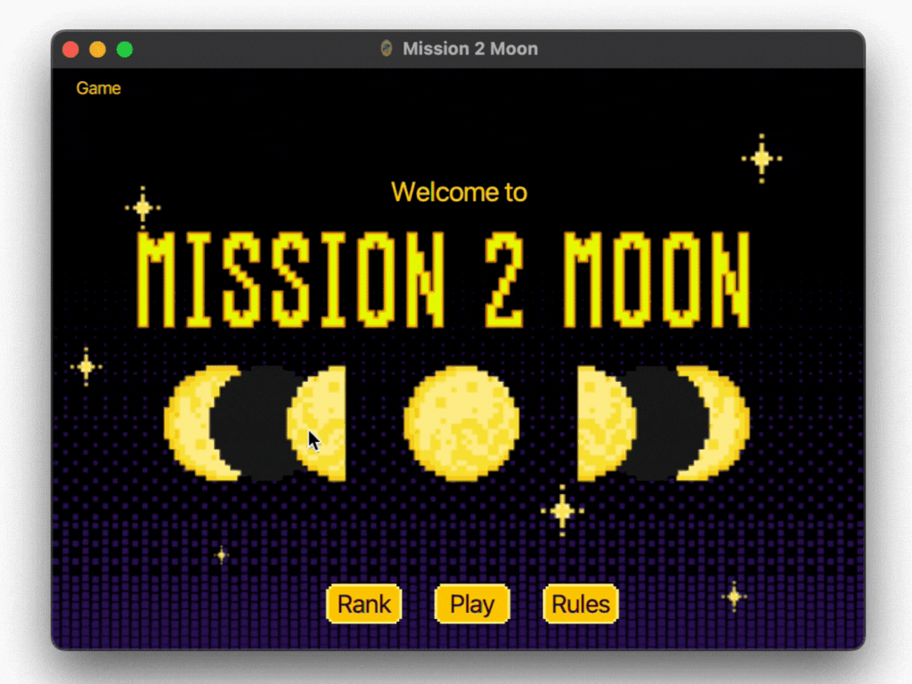

# m2m

Mission 2 Moon is a fun and interactive word-typing game where the player controls a spaceship and fights against a boss. This project is created using Scala and ScalaFx and developed as part of the assignment for the object-oriented programming(OOP) course. In this game, players can select different game levels (Easy, Normal, Hard), each offering different difficulties in terms of boss health and word complexity.

## Game Features

- **Player Selection**: Choose a spaceship for your player from a predefined list.
- **Difficulty Levels**:
- **Easy**: Boss dies after 5 hits; words are simple.
- **Normal**: Boss dies after 5 hits; words are moderately challenging.
- **Hard**: Boss dies after 10 hits; words are difficult.
- **Score System**: The game tracks and saves the player’s name, chosen level, and elapsed time after completion.

## Gameplay

- **Start the Game**: Enter your player name and select your spaceship on the selection page.
- **Choose Level**: Pick the difficulty level: Easy, Normal, or Hard.
- **Play**: The game will display words that you need to type correctly. Each correct word damages the boss. Defeat the boss to win the game!
- **Leaderboard**: After the game, your score (elapsed time) will be saved and shown on the leaderboard.

## Technologies Used

- Scala: Version 2.12
- Java: Version 8
- ScalaFX: Version 8
- [SBT](https://www.scala-sbt.org/download/)
